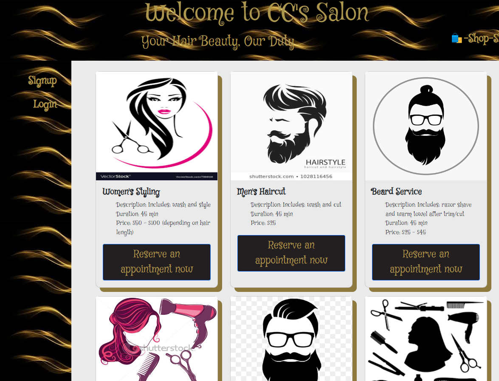
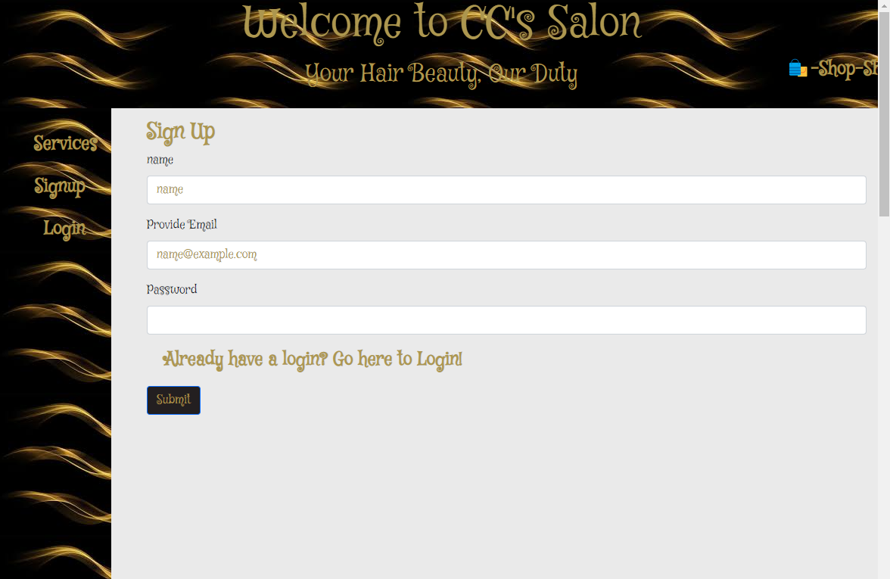

# CCsSalon

## Description

- Team motivation was to re-create a deployed website that would set appointment for the hair stylist and Allow these users to signup and login/log out.
- This project was built with someone's sister in mind so her side business could grow with a webiste.
- This solves the issue of keeping a paper calendar and creating a digital one, lets customers pay a deposit for their appointment using Stripe and nodemailer to confirm appointment.
- Our group learned how to execute research with errors and how to communicate with each other on what was being/ or had been done to that our group could help each other out.

## Table of Contents 

- [Installation](#installation)
- [Usage](#usage)
- [Deployment](#deployment)
- [Credits](#credits)
- [License](#license)

## Installation

Be sure to 'npm i' so that all dependencies can be used properly with the website.

## Usage

User must be logged in in order to complete an appointment or they will be redirected to login page or user must sign up if they do not already have login information created.

## Deployment
You can see the application deployed here: [Heroku](https://projectsalon.herokuapp.com/)

ReRepository for CC's Salon can be found at: [GitHub](https://github.com/blu3bloodedcod3r/CCsSalon)

## Credits

List of project collaborators:

-Nilofar Sabbaghian:  Me-ross Niloufar,
-Caryn James:  carynbojames,
-Jared lasiter: spmfd,
-Crystal Aguilar:  blu3bloodedcod3r,
-Calah Brown: BrownCAB

## License

MIT

## Badges

## Features

Our features include user being able to create a user login, the ability to book appointments (if logged in).